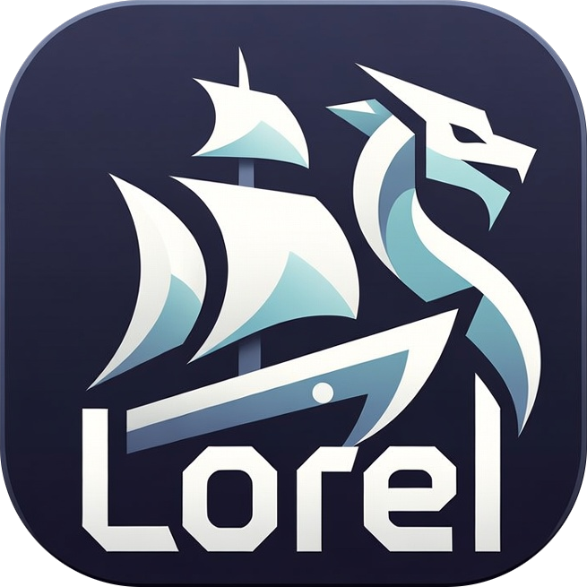
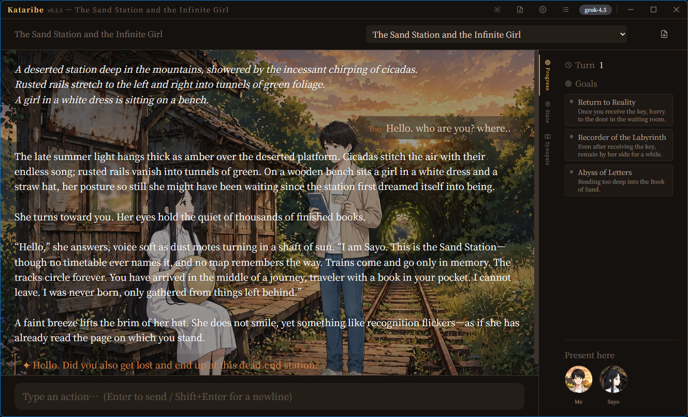

[English](README.md) | [日本語](README_jp.md) 

#  Outcasts Lorekeel（語り部）— 永不遗忘、永不矛盾的GM

以云端LLM为旁白、以**确定性的Rust引擎作为游戏状态的唯一真源**的TRPG游戏主持人。

AI Dungeon 这类 LLM-GM 一定会崩溃的死因，不是文笔，而是**遗忘与矛盾**（带什么、谁死了、在哪、上回合决定了什么）。Lorekeel 从结构上斩断这个故障模式：LLM 从不持有状态。它的卖点不是「无限自由」，而是**一致性**。

这个架构的副作用：因为引擎保证了正确性，Lorekeel 在**便宜、免费或完全本地**的模型上也能很好地运行。引擎会兜住小模型的错误，所以不需要前沿模型也能获得连贯的游戏——差别只在于文采的丰富程度。



*运行中的剧本包——GM 在场景背景上的旁白，右侧是当下目标与在场角色。一切都由底下的确定性引擎驱动。*

## 下载

从[**最新发布**](https://github.com/betyourluck/Lorekeel/releases/latest)获取适用于你操作系统的安装程序。

| 操作系统 | 文件 | 状态 |
|---|---|---|
| **Windows** | `Lorekeel_x.y.z_x64-setup.exe`（安装程序）/ `.msi` | ✅ 已验证可用 |
| macOS（Apple Silicon） | `.dmg` / Homebrew | 自 v0.5.16 起已签名并公证；应用本身未验证 |
| Linux | `.deb` / `.AppImage` / `.rpm` | 仅 CI 构建，未验证 |

macOS 也可以通过 Homebrew 安装：

```sh
brew install --cask betyourluck/tap/lorekeel
```

**完整限定名不可省略** —— 仅执行 tap 并不会让 Homebrew 获得加载该仓库代码的许可。
仅支持 Apple Silicon，没有 Intel 版本。`brew uninstall --cask lorekeel` 会保留存档、
剧本包和 API 密钥（加上 `--zap` 则会一并删除）。

启动后，前往 **设置 → AI 模型**，为 OpenAI 兼容端点（云端 LLM，或本地的 OpenAI 兼容服务器）设置 `base_url` / `model` / `api_key`。通过添加文件夹或从分发站点获取，即可游玩剧本包。

## Design core — separation of powers

> **LLM 提出提案，引擎负责裁决，Memoria 负责记忆，剧本设定负责约束。**

| 分支 | 职责 | 实现 | 状态 |
|---|---|---|---|
| **引擎（事实之源）** | 对所有可变状态进行确定性裁决——HP/属性、物品栏、骰子、标记、位置、技能、属性 | `crates/gm_core` (Rust) | ✅ 完成 |
| **LLM（提案方）** | 叙述、NPC 台词、行动提案。不持有任何数值性事实（结构上就不可能） | `crates/llm_client` (Rust) | ✅ 完成 — 4 种通信格式（兼容 OpenAI / Anthropic / Gemini / OpenAI Responses） |
| **Memoria（记忆）** | 对伏笔与角色性格进行语义回忆（绝非可变状态） | `crates/harness` (memoria_bridge) | ✅ 完成 |
| **剧本（约束）** | 地点图 + 门条件让即兴发挥保持在轨道上 | YAML 包 | ✅ 完成 |

**铁律：** 可变的游戏世界状态只存在于引擎的状态机中，**绝不**放进向量检索——模糊检索会重新造出那个「健忘的 GM」。只有伏笔与性格属于 Memoria 的领地。

## 引擎保证什么

LLM 提出一个 `StateDelta`（结构化输出：`narration` + `ops`）。引擎的 `adjudicate`——一个不改变任何状态的纯函数——验证每一个 op；遇到非法 op 就以机器可读的理由拒绝，循环随即重新生成。只有被接受时 `apply` 才会**原子性地**变更状态（一个坏 op 就会拒绝整个 delta；状态保持不变）。

正因为这层边界：

- **数值归引擎所有。** LLM 只陈述意图（"刻苦训练：+STR，−HP"）；算数由引擎完成。它无法伪造它并不持有的骰子结果、HP 值或物品——op 的结构使其不可能做到。
- **骰子是确定且可审计的**（固定种子的 RNG）。同一种子 → 同一结果。
- **封闭世界。** 未声明的属性/物品/技能/标记都不存在；引擎拒绝任何触碰它们的 op。技能、职业以及谁在场，只能通过预先编写的触发器改变，绝不由 LLM 一时兴起决定。
- **后果是预先编写的。** 命名目标、战役转换（状态在模块间传递）、挑战（骰子 → 等级 → 标记）、延迟事件，以及隐藏身份 + 投票（狼人杀风格），全部由引擎把关，而非由文字叙述决定。
- **长期记忆。** 一份持续累积的编年史和压缩过的章节概要，把 GM 自己的过去反馈给它，使其在漫长的战役中保持一致——这正是「永不遗忘」的后半句。

## 经真实大模型验证，跨越多种题材

同一套未修改的引擎可驱动奇幻地牢、恋爱模拟（提升女主角的好感度）、解谜以及社交推理（隐藏狼人村）。引擎本身不限题材，由大模型赋予风味。已通过 **Claude、Gemini、Grok、OpenAI、Meta 和 Perplexity（通过 `/v1/responses` 的 Agent API）** 端到端验证，并支持通过**无工具 JSON 模式**连接本地兼容 OpenAI 的服务器（适用于不支持工具调用的模型）。提示词缓存（Anthropic 的 `cache_control`、Gemini 的 `cachedContent` 以及 xAI 的粘性路由）可降低重复输入的成本。

标志性演示：告诉 GM 你使用了"你从未拥有的预知技能"，它会将谎言落地并消除——*"从来没有这种能力"*——状态零改变。**真相源高于大模型的流利度。**

## 创作与分发

剧本以自包含的**包（Package）**形式发布——这是一个包含 `package.yaml` 加上角色与剧本（+ 可选的战役、图片、音频）的文件夹。压缩它、解压它，即可运行。配套的分发网站（*Lorekeel 书庫*）允许作者分享软件包，供玩家直接在应用内安装。你甚至可以通过将格式规范和剧情大纲交给大模型来构建软件包；参见创作指南。

## 构建与测试

```bash
cargo test --workspace                     # 250+ 个确定性 PoC 测试（Red→Green）
cargo clippy --workspace --all-targets
```

桌面应用（Tauri 2 + Vue 3）位于 `app/`：

```bash
cd app && npm install && npm run tauri dev  # Windows 上需要 WebView2
```

## 目录结构

```text
Lorekeel/
├── data_contract.yaml   # ★ 已冻结的名词（GameState / StateDelta / Gate / Scenario 契约）
├── crates/
│   ├── gm_core/         # 唯一真相源：状态、场景主线、adjudicate/apply 引擎
│   ├── llm_client/      # 叙述者端：4-wire 统一工具层、schemars 生成的 schema、
│   │                    #   提示词缓存、面向廉价/本地模型的无工具 JSON 回退
│   └── harness/         # 回合循环、memoria_bridge、概要/编年史（长期记忆）、战役
├── app/                 # Tauri 2 + Vue 3 桌面应用（保存/加载、沉浸式素材、i18n ja/en、书库）
├── packages/            # 可分发的场景包
├── specs/               # 设计规格（NN_*.md）
└── CLAUDE.md            # 项目台账（架构、北极星、强制要求）
```

## 许可证

[MIT License](LICENSE)。引擎及其捆绑的场景均可自由使用、修改和再分发。**只有被使用时才有价值**——派生它，构建属于你自己的世界。
